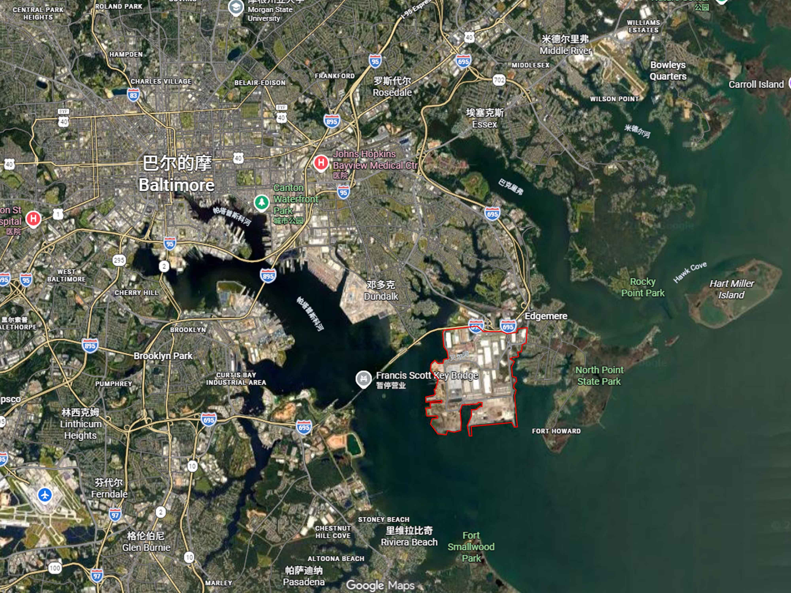

# Satellite Map → Architectural Analysis Board

**一张卫星图，生成兼顾分析信息与当地建筑拼贴的城市mapping展板。**

这是可复用的Agent Skill，将资料研究、空间分析、灰棕视觉系统、建筑影像拼贴和出图检查组织成完整工作流。

## 默认效果

- 暖白纸底、烟熏灰棕地图、炭黑建筑拼贴、少量暗酒红标记。
- 区位、主地图、建筑性质、建筑年代、层数、地方地标和交通七类信息。
- 真实当地建筑影像、简短说明、稳定编号与图面对应。
- 根据地图轮廓与留白适应排版，保持输入画幅比例。
- 数据不足时标注已核实样本与未知项，不假造全域调查。

## 案例展示

### 巴尔的摩：卫星地图转建筑分析展板

输入卫星图：



生成效果：


画面包含区位、建筑性质、建筑年代、楼层数量、
道路系统和当地建筑拼贴。生成结果为分析示意。

## 如何使用

上传一张卫星地图，然后在 Codex 中发送：

> 请使用 $skill-installer 安装 https://github.com/AidMaster-Turing/satellite-map-to-analysis-board/tree/main/skills/satellite-map-to-analysis-board ，安装完成后读取并执行该 Skill，将我上传的卫星地图生成完整建筑分析展板，保持原图比例，直接交付图片。

只要提示词：

```text
使用 $satellite-map-to-analysis-board，只给我可复制的通用提示词，不生成图片。
```

不想用skill，可使用用AidMaster图灵网站调用GPT images 2.5或GPT image 2.0生成，提示词和案例图已上传画廊，可直接生成同款，替换卫星底图即可

[AidMaster图灵使用网址](https://turneo.aidmaster.cn/home)

也可自行补充城市、范围、语言、重点专题和建筑照片。默认沿用用户语言，不固定某座城市或横竖画幅。

## 安装

核心目录：[skills/satellite-map-to-analysis-board](skills/satellite-map-to-analysis-board)。

发布后，把实际技能目录链接交给Codex的Skill Installer：

```text
使用 $skill-installer 安装：
https://github.com/AidMaster-Turing/satellite-map-to-analysis-board/tree/main/skills/satellite-map-to-analysis-board
```

也可复制完整技能文件夹到项目的 `.agents/skills/`，或官方文档所列用户目录 `~/.agents/skills/`。部分宿主／安装器使用 `~/.codex/skills/`，以实际安装器返回目录为准；同一环境不要重复安装同名Skill。未显示时重新打开任务或重启宿主。

本仓库是独立Skill源码，不是已经上架的插件。需要插件目录分发时可另行包装。机制见 [OpenAI官方文档](https://learn.chatgpt.com/docs/build-skills)。

## 能力与边界

生成展板需要宿主提供图像生成／编辑工具；真实地点研究需要联网或用户资料。只写通用提示词不需要生成工具。本Skill不绑定模型或API，不要求把密钥写进仓库。

生成式地图和建筑可能被重绘，不能替代测绘或原始档案。比例必须检查实际文件，生成器不一定精确遵循尺寸。仓库未捆绑第三方地图、照片或案例展板。

## 文件

```text
README.md
VERSION
docs/
  PUBLISH.zh-CN.md
  ACCEPTANCE.md
skills/satellite-map-to-analysis-board/
  SKILL.md
  agents/openai.yaml
  references/
    visual-system.md
    research.md
    prompt-template.md
  scripts/
    check_image_ratio.py
```

尺寸检查脚本需要Python与Pillow：

```bash
python -m pip install Pillow
python skills/satellite-map-to-analysis-board/scripts/check_image_ratio.py input.png output.png
```

退出码0=严格同比例或仅读取成功，1=比例不同，2=读取错误。脚本不编辑图片。

## 发布

[GitHub发布教程](docs/PUBLISH.zh-CN.md) · [验收场景](docs/ACCEPTANCE.md) · [独立提示词](skills/satellite-map-to-analysis-board/references/prompt-template.md)

版本0.1.0。原创指令、提示词和辅助脚本采用 [MIT许可证](LICENSE)，版权署名为2026 AidMaster-Turing。Skill目录也附有LICENSE.txt，便于单独安装时保留许可证。第三方地图、照片和其他外部素材仍遵循各自的授权，不因本仓库使用MIT而改变。
